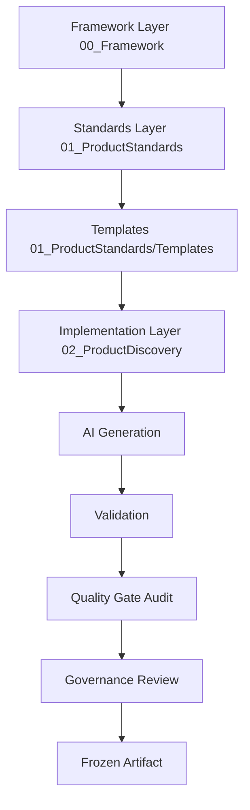

# Enterprise Product Standards Manifest

## 1. Executive Statement
This document serves as the Constitution for the **Product Standards Layer** of the Enterprise Product Discovery Framework. While the Core Framework (Layer 1) dictates the rules of physics for the enterprise (metadata, repositories, execution), this layer (Layer 2) dictates the specific domain rules for Product Discovery. It enforces absolute consistency across thousands of product artifacts, ensuring that every Vision, Problem, PRD, and User Story across the enterprise is authored, validated, and consumed with mathematical precision by both humans and autonomous AI Swarms.

## 2. Layer Architecture
The Enterprise operates on a strict three-tier architecture:
- **Framework Layer:** `00_Framework/` - Dictates *how* to build products and standards (Execution, Traceability, Registry).
- **Standards Layer:** `01_ProductStandards/` (This Layer) - Dictates the exact structure, rules, and logic for specific artifacts (e.g., Vision, PRD).
- **Implementation Layer:** `02_ProductDiscovery/` - The instantiated artifacts for a specific business domain (e.g., `MedicationManagement/Vision.md`).

## 3. Purpose & Scope
This Manifest governs the entire `01_ProductStandards` repository. It owns:
- Standard Numbering and Categorization.
- The Template Library Architecture.
- The lifecycle of a Product Standard.
- The relationship and dependency graph between Discovery artifacts.
- The internal Markdown Contract every Product Standard must implement.

## 4. Naming & Numbering Architecture
To ensure massive scalability and future-proofing, Product Standards MUST adhere to the following domain blocks:
- **`00_–09_`**: Manifests & Layer Constitution.
- **`100–199`**: Discovery Standards (Vision, Problem, Goals, Principles, Persona, Stakeholder, JTBD, Journey, Requirements).
- **`200–299`**: Definition Standards (PRD, Epic, Feature, Story).
- **`300–399`**: Architecture Standards (System, Data, Security).
- **`400–499`**: Design Standards (Wireframe, Prototype).
- **`500–599`**: Validation Standards (Usability Testing, Security Audit).
- **`600–699`**: Governance Standards (Launch Approval).
- **`700–799`**: AI Standards (Domain-specific AI Prompt Injection logic).
- **`800–899`**: Extension Standards (Custom domain logic).

## 5. Directory & Template Structure
The physical layout of `01_ProductStandards` enforces the separation of Rules (The Standard) and Execution (The Template):
```text
01_ProductStandards/
 │
 ├── 00_ProductStandardsManifest.md
 ├── 100_VisionStandard.md
 ├── ... (All .md Standards)
 │
 └── Templates/
      ├── Core/            (Cross-cutting layouts)
      ├── Foundation/      (Business Case templates)
      ├── Discovery/       (Vision, Problem, Persona templates)
      ├── Definition/      (PRD, Epic templates)
      ├── Architecture/    (ADR, System Design templates)
      ├── Design/          (UI Guidelines)
      └── Shared/          (Reusable partials: Metadata blocks, Traceability blocks)
```

## 6. Dependency Rules (Edge Types)
Product Standards form a Directed Acyclic Graph (DAG). Dependencies must explicitly declare their edge type to align with `15_TraceabilityStandards`:
- **Requires**: Standard A cannot be instantiated unless Standard B exists (e.g., Epic requires PRD).
- **Consumes**: Standard A reads data from Standard B (e.g., PRD consumes JTBD).
- **Produces**: Standard A creates boundaries for Standard B.
- **Refines**: Standard A adds fidelity to Standard B (e.g., Story refines Feature).
- **Validates**: Standard A acts as a test for Standard B.
- **References**: Standard A points to Standard B for context.
- **Constrains**: Standard A limits the options of Standard B (e.g., Architecture constrains Design).

## 7. Standard Relationship Model (The Discovery Graph)
The canonical flow of product discovery dictates the chronological instantiation of artifacts:
```text
Vision
    │
    ▼
Problem
    │
    ▼
Goals
    │
    ▼
Principles
    │
    ├────────────┐
    ▼            ▼
Persona       Stakeholder
    │            │
    └────┬───────┘
         ▼
        JTBD
         ▼
      Journey
         ▼
 Requirements
         ▼
       PRD
         ▼
 Epic
         ▼
 Feature
         ▼
 Story
```

## 8. Standard Lifecycle
Product Standards mirror the Core Framework's lifecycle exactly to maintain enterprise consistency:
`Draft` ➡ `In Review` ➡ `Approved` ➡ `Frozen` ➡ `Superseded` ➡ `Deprecated` ➡ `Retired`.

## 9. The Standard Contract
Every standard (`100` through `999`) MUST implement the following 20 headers to guarantee extreme reusability and AI compatibility:
1. **Executive Statement**: High-level summary of the standard.
2. **Purpose**: Why this standard exists.
3. **Scope**: What this standard covers.
4. **Ownership**: Which enterprise domain owns it.
5. **Consumers**: Who reads the generated artifact.
6. **Producers**: Who writes the generated artifact.
7. **Inputs**: Required upstream artifacts.
8. **Outputs**: Expected deliverables.
9. **Dependencies**: DAG edges (Section 6).
10. **Artifact Classification**: Alignment with Framework taxonomy.
11. **Required Sections**: The markdown payload.
12. **Template Reference**: Absolute path to `/Templates`.
13. **Validation**: Test criteria for `07_ValidationStandards`.
14. **Acceptance Criteria**: Definition of Done.
15. **Quality Gates**: Hard blocks for `08_QualityGates`.
16. **Traceability**: Node connections for `15_TraceabilityStandards`.
17. **AI Context**: LLM Hydration rules.
18. **Extension Points**: Where custom logic can be injected.
19. **Success Criteria**: Business validation.
20. **Exit Criteria**: Checklist to transition to `Frozen`.

## 10. AI Generation Rules
As an AI-first framework, every standard must define explicitly how LLMs interact with it:
- **AI Generation Rules**: How an agent authors the artifact.
- **AI Validation Rules**: How a QA agent verifies the artifact.
- **AI Review Rules**: How a Review agent audits the artifact.
- **AI Consumption Rules**: How a downstream agent extracts context from the artifact.
- **AI Constraints**: Explicit negative constraints defining what an AI agent MUST NOT do.

## 11. Standard Registry
Every Product Standard must adhere to `17_RegistryStandards` by declaring its Registry Entry Requirements (UUID, Domain, Sync Strategy) allowing autonomous Swarms to discover the standard globally.

## 12. Product Discovery Execution Graph


## 13. Non-Goals
To maintain absolute separation of concerns, this Manifest does NOT:
- Define actual product artifacts (Implementation Layer).
- Define framework rules (Framework Layer).
- Define templates (The Template files themselves).
- Define implementation methodology.
- Define architecture.

## 14. Exit Criteria
This artifact may transition to Frozen only if:
- [x] Architecture Review Passed
- [x] Numbering Topology Validated
- [x] Contract Completeness Verified
- [x] Core Framework Alignment Confirmed
- [x] Executive Approval Granted
