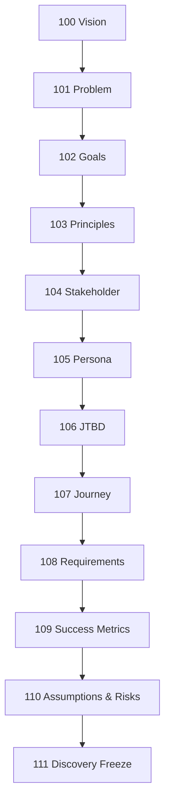
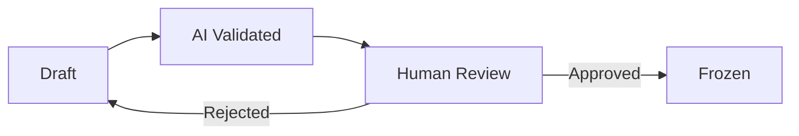
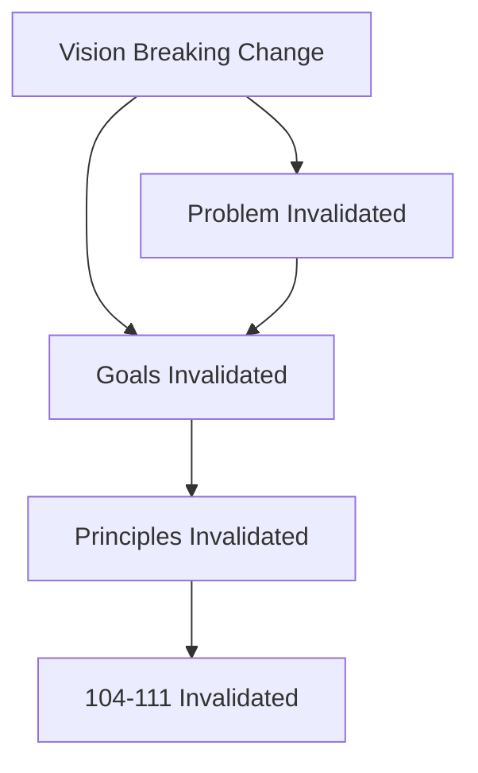
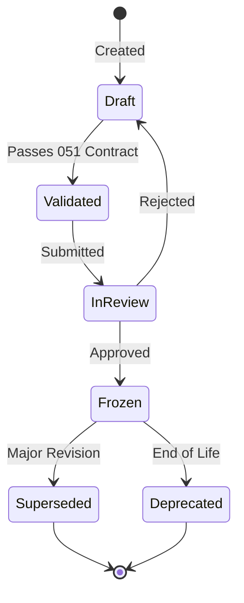
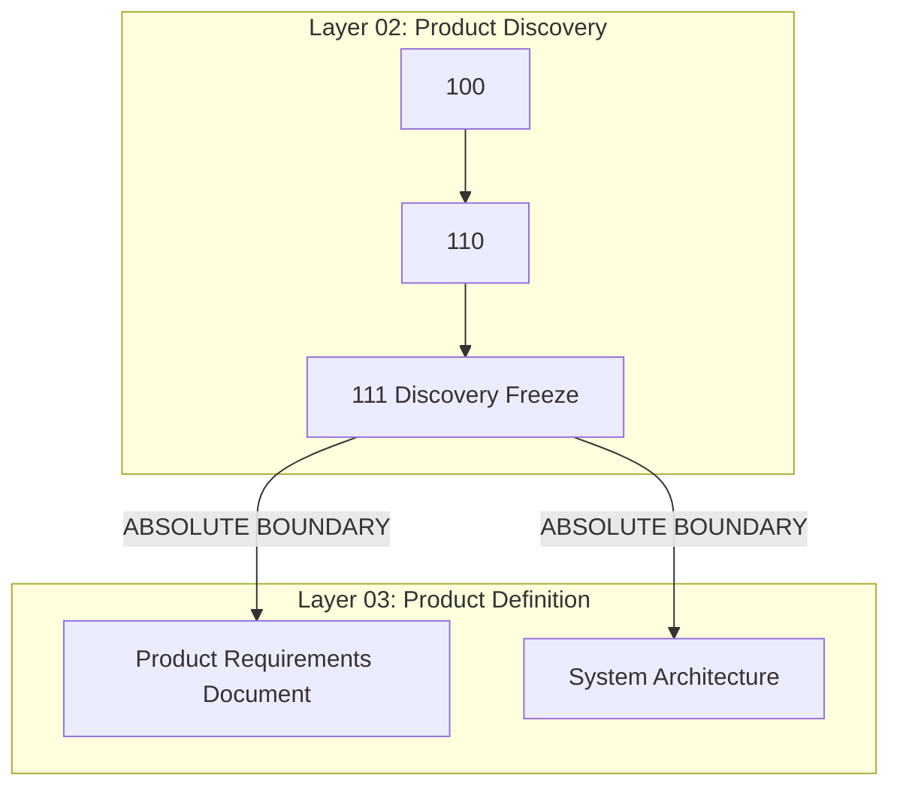

# Discovery Architecture Manifest

## 1. Discovery Layer Purpose
The Product Discovery Layer (`02_ProductDiscovery`) exists to deterministically prove that a product is worth building before a single line of code is written or a single pixel is designed. It translates abstract corporate strategy into a rigid, measurable, and de-risked blueprint for execution. This manifest governs the structural integrity of that translation process.

## 2. Architectural Principles
- **Acyclic Dependency**: No downstream artifact may ever dictate the state of an upstream artifact. (e.g., Features cannot dictate the Vision).
- **Single Source of Truth**: Data is never duplicated. If `104_Stakeholder` needs the North Star Metric, it references `100_Vision`, it does not redefine it.
- **Strict Invalidation**: If an upstream artifact is altered (Breaking Change), all downstream artifacts are instantly invalidated until re-reviewed.
- **Decoupled Execution**: This architecture defines *what* depends on *what*. It does not dictate *how* or *when* AI or humans generate it.

## 3. Discovery Topology
The Discovery Layer is divided into three logical sub-topologies:
1. **The Core Strategy (100–103)**: Defines the *Why*, the *Problem*, the *Outcomes*, and the *Decision Rules*.
2. **The Human Context (104–107)**: Defines the *Who*, their *Needs*, and their *Journeys*.
3. **The Solution Mechanics (108–111)**: Defines the *What*, how to *Measure* it, what *Risks* exist, and the final *Freeze*.

## 4. Canonical Dependency Graph (DAG)

## 5. Artifact Responsibilities
- **100 Vision**: Defines the North Star, ultimate business impact, and scope boundaries.
- **101 Problem**: Defines the current state, desired state, and root causes.
- **102 Goals**: Defines measurable outcomes (SMART) and target metrics.
- **103 Principles**: Defines immutable decision-making philosophies and trade-off rules.
- **104 Stakeholder**: Defines all human entities impacted by the product.
- **105 Persona**: Details specific user archetypes synthesized from stakeholders.
- **106 JTBD**: Maps Jobs-To-Be-Done for the identified Personas.
- **107 Journey**: Maps the chronological workflow of the Personas achieving their JTBD.
- **108 Requirements**: Defines the core capabilities needed to enable the Journey.
- **109 Success Metrics**: Maps how Requirements achieve the Product Goals.
- **110 Assumptions & Risks**: Catalogs all untested hypotheses and systemic risks.
- **111 Discovery Freeze**: The ultimate quality gate verifying the entire DAG is sound.

## 6. Artifact Ownership Matrix
| Artifact | Standard Owner | Artifact Owner (Executor) | Reviewer |
| :--- | :--- | :--- | :--- |
| **100 Vision** | Product Arch Board | CPO | Exec Board |
| **101 Problem** | Product Arch Board | Principal PM | Product Arch Board |
| **102 Goals** | Product Arch Board | Principal PM | Analytics Lead |
| **103 Principles** | Product Arch Board | CPO | Exec Board |
| **104 Stakeholder**| Product Arch Board | UX Researcher | Principal PM |
| **105 Persona** | Product Arch Board | UX Researcher | Design Lead |
| **106 JTBD** | Product Arch Board | Product Manager | Principal PM |
| **107 Journey** | Product Arch Board | UX Designer | Design Lead |
| **108 Requirements**| Product Arch Board | Product Manager | Engineering Lead |
| **109 Success Metrics**| Product Arch Board | Data Analyst | Analytics Lead |
| **110 Assumptions**| Product Arch Board | Product Manager | Enterprise Architect |
| **111 Freeze** | Product Arch Board | Enterprise Arch Board | Exec Board |

## 7. Upstream Context Requirements
| Downstream Artifact | Mandatory Upstream Context (Required for Hydration) |
| :--- | :--- |
| **101 Problem** | 100 |
| **102 Goals** | 100, 101 |
| **103 Principles** | 100, 101, 102 |
| **104 Stakeholder**| 100, 101, 102, 103 |
| **105 Persona** | 104 |
| **106 JTBD** | 101, 105 |
| **107 Journey** | 103, 105, 106 |
| **108 Requirements**| 102, 103, 107 |
| **109 Success Metrics**| 102, 108 |
| **110 Assumptions**| 101, 108, 109 |
| **111 Freeze** | 100 through 110 |

## 8. Downstream Outputs
Every artifact MUST explicitly declare what context it is exporting to the network.
- **100** produces Target Market and North Star Metric.
- **101** produces Root Causes.
- **102** produces Target KPIs.
- **103** produces Trade-off Matrices.
- **104** produces the Global Actor List.
- **105** produces Empathy Maps and Pain Points.
- **106** produces Core User Needs.
- **107** produces Interaction Touchpoints.
- **108** produces Capability Boundaries.
- **109** produces Telemetry Requirements.
- **110** produces the Risk Register.

## 9. Dependency Rules
- **Hard Edges**: A downstream node cannot transition to `Status: Validated` unless all upstream hard dependencies are `Status: Frozen`.
- **Inheritance**: No artifact inherits from another artifact. They *reference* each other. Standards inherit from `050`; Artifacts inherit from `051`.

## 10. Traceability Rules
- Every requirement or capability in `108` MUST trace to a JTBD in `106`.
- Every JTBD in `106` MUST trace to a Persona in `105`.
- Every metric in `109` MUST trace to a Goal in `102`.
- Any orphaned node (a requirement with no JTBD, a persona with no stakeholder) triggers an immediate architecture violation.

## 11. Review Flow

Reviews follow the artifact ownership matrix and must be performed by the designated reviewer for each artifact.

## 12. Approval Flow
Approvals require cryptographic or explicit systemic sign-off by the role designated in the Ownership Matrix. Proxies are not permitted for `100`, `103`, and `111`.

## 13. Feedback Loop
If an artifact uncovers a flaw in an upstream assumption, it triggers a **Feedback Event**. The downstream artifact is paused, and an issue is raised against the upstream artifact.

## 14. Invalidation Rules
- **Patch/Minor Updates**: Upstream changes that do not alter the semantic meaning (e.g., fixing typos, adding secondary context) do NOT invalidate downstream nodes.
- **Major/Breaking Updates**: Altering a North Star Metric, Root Cause, or Principle immediately invalidates ALL downstream nodes, reverting them to `Status: In Review` (Re-validation required).

## 15. Blast Radius Rules
The Blast Radius is purely topological.

A change at node `N` invalidates nodes `N+1` through `111`.

## 16. Version Evolution Rules
- **Drafting**: Semantic versioning is suspended while in `Draft`.
- **Freezing**: Upon freezing, the artifact becomes `v1.0`.
- **Iteration**: Any post-freeze modification requires branching, editing, re-validating, and then merging as `v1.1` (Minor) or `v2.0` (Major).

## 17. Artifact State Model

## 18. Freeze Boundaries
The Discovery Layer contains exactly one Absolute Freeze Boundary.

No artifact outside the Discovery Layer may be instantiated until `111_DiscoveryFreezeStandard` is explicitly Approved and Frozen.

## 19. Discovery Completion Criteria
The Product Discovery phase is architecturally complete when:
1. Artifacts `100` through `110` are `Status: Frozen`.
2. Artifact `111` calculates zero Traceability Violations.
3. The Executive Board cryptographically signs `111`.

## 20. Architecture Success Criteria
This Architecture Manifest is successful if a multi-agent AI system or a distributed human team can navigate from `100` to `111` without encountering a single circular dependency, ownership conflict, or ambiguous state transition.
